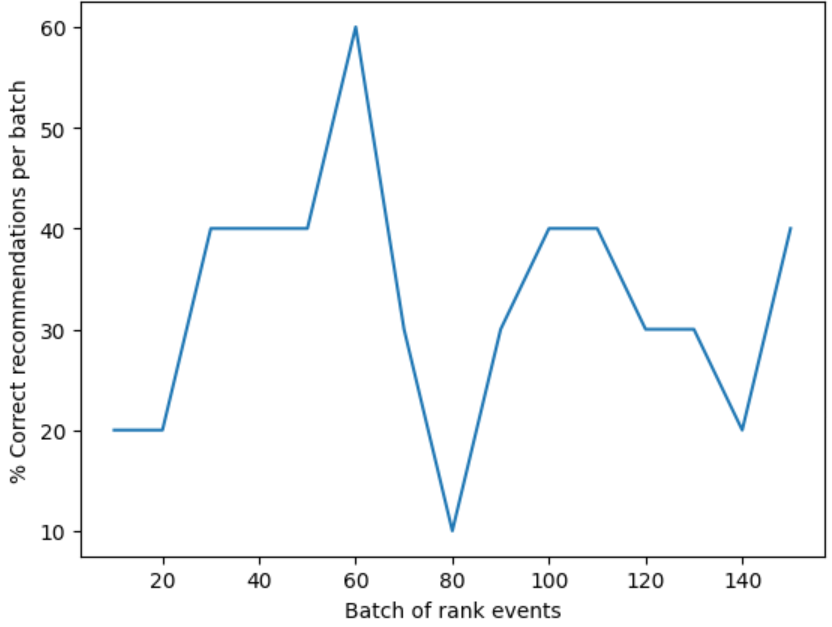

---
lab:
  title: Usare Personalizza esperienze di Azure AI con i notebook di Visual Studio Code per simulare un ciclo
---
> **Importante** A partire dall'autunno 2023, non è più possibile creare nuove risorse di Personalizza esperienze. Usare questo repository solo per riferimento se si dispone di una risorsa di Personalizza esperienze esistente.

In questo esercizio si userà Personalizza esperienze di Azure AI con notebook in Visual Studio Code per simulare un ciclo di apprendimento.

## Creare una risorsa di Personalizza esperienze di Azure AI usando il portale di Azure

1. Nel portale di Azure cercare i **Servizi di Azure AI**. Selezionare quindi **Crea** in **Personalizza esperienze** nell'elenco dei risultati.

   

1. Selezionare la sottoscrizione, immettere il nome di un gruppo di risorse e il nome della risorsa. Per piano tariffario scegliere **F0 gratuito**.
1. Selezionare **Rivedi e crea** per esaminare le scelte, quindi seleziona **Crea** per creare la risorsa.
1. Passare alla risorsa di Personalizza esperienze di Azure AI appena creata, quindi nel riquadro Chiavi ed endpoint copiare e incollare la **chiave** e l'**endpoint** da qualche posizione sicura per usarla in un secondo momento:

   

1. Selezionare Configura nel riquadro di spostamento e quindi impostare il **tempo di attesa ricompensa** su **10 minuti** (se non è già impostato) e impostare la **frequenza di aggiornamento del modello** su **15 secondi**.
1. Seleziona **Salva**.

## Configurare il notebook

1. Nell'editor di Visual Studio Code premere **CTRL+MAIUSC+P** e selezionare **Crea: Nuovo Jupyter Notebook**.
1. Salvare il file e denominarlo **my-notebook** nel dispositivo.
1. È ora necessario installare le estensioni necessarie. Selezionare **Seleziona kernel** in alto a destra nel notebook. Selezionare quindi **Installa/Abilita estensioni suggerite**.

   

   > [!NOTE]
   > Se questa operazione è già stata eseguita in precedenza, questa opzione non verrà visualizzata ed è possibile ignorare questo passaggio.

1. Attendere l'installazione delle estensioni, quindi selezionare **Ambienti Python** nell'elenco a discesa visualizzato.
1. Selezionare quindi l'ambiente consigliato in alto.

## Preparazione dei dati

Ai fini di questo esercizio si creerà un elenco di utenti e un elenco di prodotti per il caffè che è possibile usare come dati di base per Personalizza esperienze di Azure AI.

1. Copiare il codice JSON seguente in un file vuoto e salvarlo come `users.json` nella stessa cartella del file notebook.

   ```json
   {
     "Alice": {
       "Sunny": {
         "Morning": "Cold brew",
         "Afternoon": "Iced mocha",
         "Evening": "Cold brew"
       },
       "Rainy": {
         "Morning": "Latte",
         "Afternoon": "Cappucino",
         "Evening": "Latte"
       },
       "Snowy": {
         "Morning": "Cappucino",
         "Afternoon": "Cappucino",
         "Evening": "Cappucino"
       }
     },
     "Bob": {
       "Sunny": {
         "Morning": "Cappucino",
         "Afternoon": "Iced mocha",
         "Evening": "Cold brew"
       },
       "Rainy": {
         "Morning": "Latte",
         "Afternoon": "Latte",
         "Evening": "Latte"
       },
       "Snowy": {
         "Morning": "Iced mocha",
         "Afternoon": "Iced mocha",
         "Evening": "Iced mocha"
       }
     },
     "Cathy": {
       "Sunny": {
         "Morning": "Latte",
         "Afternoon": "Cold brew",
         "Evening": "Cappucino"
       },
       "Rainy": {
         "Morning": "Cappucino",
         "Afternoon": "Latte",
         "Evening": "Iced mocha"
       },
       "Snowy": {
         "Morning": "Cold brew",
         "Afternoon": "Iced mocha",
         "Evening": "Cappucino"
       }
     },
     "Dave": {
       "Sunny": {
         "Morning": "Iced mocha",
         "Afternoon": "Iced mocha",
         "Evening": "Iced mocha"
       },
       "Rainy": {
         "Morning": "Latte",
         "Afternoon": "Latte",
         "Evening": "Latte"
       },
       "Snowy": {
         "Morning": "Cappucino",
         "Afternoon": "Cappucino",
         "Evening": "Cappucino"
       }
     }
   }
   ```

1. Copiare quindi il codice seguente e salvarlo in un file denominato `coffee.json`:

   ```json
   [
     {
       "id": "Cappucino",
       "features": [
         {
           "type": "hot",
           "origin": "kenya",
           "organic": "yes",
           "roast": "dark"
         }
       ]
     },
     {
       "id": "Cold brew",
       "features": [
         {
           "type": "cold",
           "origin": "brazil",
           "organic": "yes",
           "roast": "light"
         }
       ]
     },
     {
       "id": "Iced mocha",
       "features": [
         {
           "type": "cold",
           "origin": "ethiopia",
           "organic": "no",
           "roast": "light"
         }
       ]
     },
     {
       "id": "Latte",
       "features": [
         {
           "type": "hot",
           "origin": "brazil",
           "organic": "no",
           "roast": "dark"
         }
       ]
     }
   ]
   ```

1. Copiare e incollare il codice seguente in un file e salvarlo come `example-rankrequest.json`:

   ```json
   {
     "contextFeatures": [],
     "actions": [],
     "excludedActions": [],
     "eventId": "",
     "deferActivation": false
   }
   ```

## Impostare l'endpoint e la chiave

1. Nella parte superiore del notebook aggiungere il codice seguente per includere i moduli necessari:

   ```python
   import json
   import matplotlib.pyplot as plt
   import random
   import requests
   import time
   import uuid
   import datetime
   ```

1. Selezionare la cella, quindi selezionare il pulsante Esegui a sinistra della cella:

   

   > [!NOTE]
   > Selezionare il pulsante Esegui ogni volta che si popola una nuova cella. Se viene richiesto di installare il pacchetto ipykernel, selezionare **Installa**.

1. Selezionare **+ Codice** nella parte superiore del notebook per creare una nuova cella di codice. Aggiungere quindi il codice seguente:

   ```python
   # Replace 'personalization_base_url' and 'resource_key' with your valid endpoint values.
   personalization_base_url = "<your-endpoint>"
   resource_key = "<your-resource-key>"
   ```

1. Sostituire il valore **personalization_base_url** con l'endpoint copiato e il valore **resource_key** con la chiave.

## Tenere traccia delle iterazioni

1. Successivamente, creare il codice per prendere nota delle ore di inizio e di fine delle funzioni iterative che verranno usate in un secondo momento. Aggiungere il codice seguente a una nuova cella:

   ```python
   # Print out current datetime
   def currentDateTime():
       currentDT = datetime.datetime.now()
       print (str(currentDT))

   # ititialize variable for model's last modified date
   modelLastModified = ""

   def get_last_updated(currentModifiedDate):

       print('-----checking model')

       # get model properties
       response = requests.get(personalization_model_properties_url, headers = headers, params = None)

       print(response)
       print(response.json())

       # get lastModifiedTime
       lastModifiedTime = json.dumps(response.json()["lastModifiedTime"])

       if (currentModifiedDate != lastModifiedTime):
           currentModifiedDate = lastModifiedTime
           print(f'-----model updated: {lastModifiedTime}')
   ```

1. Non dimenticare di eseguire la nuova cella dopo aver aggiunto il nuovo codice.

## Ottenere la configurazione dei criteri e del servizio

1. Sarà quindi necessario convalidare lo stato del servizio ottenendo i criteri e la configurazione del servizio. A tal fine, aggiungere il codice seguente a una nuova cella:

   ```python
   def get_service_settings():

       print('-----checking service settings')

       # get learning policy
       response = requests.get(personalization_model_policy_url, headers = headers, params = None)

       print(response)
       print(response.json())

       # get service settings
       response = requests.get(personalization_service_configuration_url, headers = headers, params = None)

       print(response)
       print(response.json())
   ```

1. Assicurarsi di eseguire la nuova cella di codice.

Il codice è costituito da una funzione che effettua due chiamate all'API del servizio. Quando viene chiamata la funzione, restituisce i valori del servizio usando la risposta.

## Configurare gli URL per le chiamate e leggere i file JSON

A questo punto si aggiungerà il codice a:

- compilare gli URL usati nelle chiamate REST
- impostare l'intestazione di sicurezza usando la chiave della risorsa Personalizza esperienze
- impostare il valore di inizializzazione casuale per l'ID evento Rank
- leggere nei file di dati JSON
- metodo chiamare get_last_updated - i criteri di apprendimento sono stati rimossi nell'output di esempio
- metodo chiamare get_service_settings

1. A tale scopo, aggiungere il codice seguente a una nuova cella ed eseguirlo:

   ```python
   # build URLs
   personalization_rank_url = personalization_base_url + "personalizer/v1.0/rank"
   personalization_reward_url = personalization_base_url + "personalizer/v1.0/events/" #add "{eventId}/reward"
   personalization_model_properties_url = personalization_base_url + "personalizer/v1.0/model/properties"
   personalization_model_policy_url = personalization_base_url + "personalizer/v1.0/configurations/policy"
   personalization_service_configuration_url = personalization_base_url + "personalizer/v1.0/configurations/service"

   headers = {'Ocp-Apim-Subscription-Key' : resource_key, 'Content-Type': 'application/json'}

   # context
   users = "users.json"

   # action features
   coffee = "coffee.json"

   # empty JSON for Rank request
   requestpath = "example-rankrequest.json"

   # initialize random
   random.seed(time.time())

   userpref = None
   rankactionsjsonobj = None
   actionfeaturesobj = None

   with open(users) as handle:
       userpref = json.loads(handle.read())

   with open(coffee) as handle:
       actionfeaturesobj = json.loads(handle.read())

   with open(requestpath) as handle:
       rankactionsjsonobj = json.loads(handle.read())

   get_last_updated(modelLastModified)
   get_service_settings()

   print(f'User count {len(userpref)}')
   print(f'Coffee count {len(actionfeaturesobj)}')
   ```

1. La chiamata deve restituire una risposta simile alla seguente:

   ```bash
   -----checking model
   <Response [200]>
   {'creationTime': '2023-09-22T14:58:45+00:00', 'lastModifiedTime': '2023-09-22T14:58:45+00:00'}
   -----model updated: "2023-09-22T14:58:45+00:00"
   -----checking service settings
   <Response [200]>
   {'name': '917554355a3347a1af3d2935d521426a', 'arguments': '--cb_explore_adf --epsilon 0.20000000298023224 --power_t 0 -l 0.001 --cb_type mtr -q ::'}
   <Response [200]>
   {'rewardWaitTime': 'PT10M', 'defaultReward': 0.0, 'rewardAggregation': 'earliest', 'explorationPercentage': 0.2, 'modelExportFrequency': 'PT15S', 'logRetentionDays': 90, 'lastConfigurationEditDate': '2021-01-01T00:00:00', 'learningMode': 'Online'}
   User count 4
   Coffee count 4
   ```

1. Il codice di risposta deve essere `<Response [200]>` per indicare una chiamata riuscita. **RewardWaitTime** deve essere visualizzato come 10 minuti e **modelExportFrequency** deve essere di 15 secondi.

## Configurare un grafico nel portale di Azure

Il codice effettua richieste all'API. Per ottenere una metrica valida per le richieste, è possibile creare un grafico delle metriche nel portale di Azure:

1. Nel portale di Azure passare alla risorsa Personalizza esperienze di Azure AI.

1. Selezionare **Metriche** in Monitoraggio nel riquadro di spostamento.

   

1. Lo spazio dei nomi **Ambito** e **Metrica** è già impostato. È sufficiente selezionare la **metrica** delle **chiamate riuscite** e l'**aggregazione** della **somma**.

1. Modificare il filtro ora sulle ultime quattro ore.

## Creare ID evento univoci

Aggiungere quindi il codice per generare un ID univoco per ogni chiamata API di classificazione. Usare questo ID per identificare le informazioni sulle chiamate di classificazione e ricompensa per le richieste.

1. A tale scopo, creare una nuova cella di codice nel notebook e aggiungere quanto segue:

   ```python
   def add_event_id(rankjsonobj):
       eventid = uuid.uuid4().hex
       rankjsonobj["eventId"] = eventid
       return eventid
   ```

1. Ricordarsi di eseguire la nuova cella di codice.

> [!NOTE]
> In uno scenario reale, è necessario impostarlo su un valore simile all'ID transazione di un acquisto.

## Ottenere un utente, l'ora del giorno e il tempo

È ora possibile aggiungere una funzione per:

- Selezionare una combinazione univoca di utente, ora del giorno e meteo.
- Aggiungere gli elementi selezionati a un oggetto JSON che verrà inviato all'API Rank tramite una chiamata.

A tale scopo, aggiungere il codice seguente a una nuova cella ed eseguirlo:

```python
def add_random_user_and_contextfeatures(namesoption, weatheropt, timeofdayopt, rankjsonobj):
    name = namesoption[random.randint(0,3)]
    weather = weatheropt[random.randint(0,2)]
    timeofday = timeofdayopt[random.randint(0,2)]
    rankjsonobj['contextFeatures'] = [{'timeofday': timeofday, 'weather': weather, 'name': name}]
    return [name, weather, timeofday]
```

## Aggiungere dati sul caffè

Successivamente, si crea una funzione per ottenere l'intero elenco di prodotti per il caffè a un oggetto JSON che viene quindi inviato all'API Rank.

A tale scopo, aggiungere il codice seguente a una nuova cella ed eseguirlo:

```python
def add_action_features(rankjsonobj):
    rankjsonobj["actions"] = actionfeaturesobj
```

## Confrontare le stime con le preferenze utente note

È quindi possibile creare una funzione per confrontare la preferenza di un utente per un caffè specifico, prendendo in considerazione i dettagli, ad esempio il tempo e l'ora del giorno, con ciò che suggerisce Personalizza esperienze di Azure AI.

1. A tale scopo, creare una nuova cella, aggiungere il codice seguente ed eseguirlo:

   ```python
   def get_reward_from_simulated_data(name, weather, timeofday, prediction):
       if(userpref[name][weather][timeofday] == str(prediction)):
           return 1
       return 0
   ```

1. Questa funzione deve essere eseguita dopo ogni chiamata dell'API Rank. Se il suggerimento corrisponde, nella risposta viene restituito un punteggio di `1`. Se non corrisponde, verrà restituito `0`.

## Creare un ciclo con chiamate alle API Rank e Reward

Le celle precedenti vengono usate per configurare il notebook per il ciclo. A questo punto si configurerà il ciclo. Il ciclo copre il corpo principale del lavoro nel notebook. Ottiene un utente casuale, ottiene l'elenco di caffè e li invia all'API Rank. Confronta la stima di Personalizza esperienze di Azure AI con le perferenze note dell'utente e quindi invia nuovamente la ricompensa a Personalizza esperienze di Azure AI.

Per creare il ciclo, aggiungere il codice seguente a una nuova cella ed eseguirlo:

```python
def iterations(n, modelCheck, jsonFormat):

    i = 1

    # default reward value - assumes failed prediction
    reward = 0

    # Print out dateTime
    currentDateTime()

    # collect results to aggregate in graph
    total = 0
    rewards = []
    count = []

    # default list of user, weather, time of day
    namesopt = ['Alice', 'Bob', 'Cathy', 'Dave']
    weatheropt = ['Sunny', 'Rainy', 'Snowy']
    timeofdayopt = ['Morning', 'Afternoon', 'Evening']


    while(i <= n):

        # create unique id to associate with an event
        eventid = add_event_id(jsonFormat)

        # generate a random sample
        [name, weather, timeofday] = add_random_user_and_contextfeatures(namesopt, weatheropt, timeofdayopt, jsonFormat)

        # add action features to rank
        add_action_features(jsonFormat)

        # show JSON to send to Rank
        print('To: ', jsonFormat)

        # choose an action - get prediction from Personalizer
        response = requests.post(personalization_rank_url, headers = headers, params = None, json = jsonFormat)

        # show Rank prediction
        print ('From: ',response.json())

        # compare personalization service recommendation with the simulated data to generate a reward value
        prediction = json.dumps(response.json()["rewardActionId"]).replace('"','')
        reward = get_reward_from_simulated_data(name, weather, timeofday, prediction)*10

        # show result for iteration
        print(f'   {i} {currentDateTime()} {name} {weather} {timeofday} {prediction} {reward}')

        # send the reward to the service
        response = requests.post(personalization_reward_url + eventid + "/reward", headers = headers, params= None, json = { "value" : reward })

        # for every N rank requests, compute total correct  total
        total =  total + reward

        # every N iteration, get last updated model date and time
        if(i % modelCheck == 0):

            print("**** 10% of loop found")

            get_last_updated(modelLastModified)

        # aggregate so chart is easier to read
        if(i % 10 == 0):
            rewards.append( total)
            count.append(i)
            total = 0

        i = i + 1

    # Print out dateTime
    currentDateTime()

    return [count, rewards]
```

Ecco un esempio della struttura JSON inviata dalla funzione all'API Rank:

```python
{
    'contextFeatures':[
      {
          'timeofday':'Evening',
          'weather':'Snowy',
          'name':'Alice'
      }
    ],
    'actions':[
      {
          'id':'Cappucino',
          'features':[
            {
                'type':'hot',
                'origin':'kenya',
                'organic':'yes',
                'roast':'dark'
            }
          ]
      }
        ...rest of the coffee list
    ],
    'excludedActions':[

    ],
    'eventId':'b5c4ef3e8c434f358382b04be8963f62',
    'deferActivation':False
}
```

L'API Rank risponderà con una risposta strutturata come segue:

```python
{
    'ranking': [
        {'id': 'Latte', 'probability': 0.85 },
        {'id': 'Iced mocha', 'probability': 0.05 },
        {'id': 'Cappucino', 'probability': 0.05 },
        {'id': 'Cold brew', 'probability': 0.05 }
    ],
    'eventId': '5001bcfe3bb542a1a238e6d18d57f2d2',
    'rewardActionId': 'Latte'
}
```

Ogni iterazione del ciclo visualizzerà l'utente, il meteo e l'ora del giorno selezionati in modo casuale e la ricompensa determinata in modo appropriato:

```bash
1 Alice Rainy Morning Latte 1
```

Una ricompensa di `1` indica che la risorsa Personalizza esperienze di Azure AI ha selezionato il tipo di caffè corretto per questa particolare combinazione di utente, meteo e ora del giorno.

## Eseguire il ciclo e visualizzare i risultati del grafico

Personalizza esperienze di Azure AI richiede alcune migliaia di chiamate all'API Rank e all'API Reward per creare un modello. Si eseguirà il ciclo per un numero impostato di iterazioni.

1. A tale scopo, creare una nuova cella di codice, aggiungere il codice seguente ed eseguirlo:

   ```python
   # max iterations
   num_requests = 150

   # check last mod date N% of time - currently 10%
   lastModCheck = int(num_requests * .10)

   jsonTemplate = rankactionsjsonobj

   # main iterations
   [count, rewards] = iterations(num_requests, lastModCheck, jsonTemplate)
   ```

1. Aggiornare il grafico delle metriche nel portale di Azure ogni tanto per visualizzare le chiamate totali al servizio.
1. Questo evento può essere eseguito per un periodo di tempo. Non chiudere il blocco appunti fino al termine. Quando il ciclo ha eseguito circa 20.000 chiamate, ovvero una chiamata di classificazione e ricompensa per ogni iterazione del ciclo, il ciclo terminerà.

1. Successivamente, si crea un grafico nel notebook per tracciare i batch di eventi di classificazione e il numero di raccomandazioni corrette per ogni batch. A tale scopo, aggiungere il codice seguente in una nuova cella ed eseguirlo:

   ```python
   def createChart(x, y):
       plt.plot(x, y)
       plt.xlabel("Batch of rank events")
       plt.ylabel("Correct recommendations per batch")
       plt.show()

   createChart(count,rewards)
   ```

1. Il notebook creerà un grafico:

   

> **Suggerimento:** Idealmente, al termine del test, il ciclo dovrebbe in media fare raccomandazioni corrette a una velocità del 100% meno il valore di esplorazione (che è il 20% per impostazione predefinita), quindi l'obbiettivo è l'80%. Un modo per raggiungerlo è aumentare le iterazioni ad almeno 10.000.

Il grafico mostra la riuscita del modello in base ai criteri di apprendimento predefiniti. Questo grafico mostra che i criteri di apprendimento possono essere migliorati. A tale scopo, è possibile modificare i criteri dopo l'esecuzione delle valutazioni.

## Eseguire una valutazione offline

> [!NOTE]
> Questa sezione di questo esercizio è facoltativa perché può essere eseguita solo dopo aver effettuato almeno 50.000 chiamate alla risorsa Personalizza esperienze di Azure AI. Tuttavia, è possibile tornare a questa sezione se a un certo punto sono state eseguite 50.000 chiamate alla risorsa.

È possibile eseguire una valutazione offline per trovare un criterio di apprendimento migliore per una risorsa Personalizza esperienze di Azure AI con almeno 50.000 chiamate.

1. Nel portale di Azure, passare al riquadro Ottimizza risorse Personalizza esperienze di Azure AI e selezionare **Crea valutazione**.
1. Specificare un nome di valutazione e selezionare un intervallo di date di inizio e di fine per la valutazione del ciclo. L'intervallo di date deve includere solo i giorni su cui ci si concentra per la valutazione:

   

1. Selezionare **Avvia valutazione** per iniziare la valutazione.

1. Al termine della valutazione, selezionarlo nell'elenco delle valutazioni nel riquadro Ottimizza. Quindi esaminare le prestazioni dei criteri di apprendimento in base a dettagli come la ricompensa media, gli intervalli di attendibilità e altro ancora:

   

1. Verranno visualizzati alcuni criteri, tra cui:

   - **Online**: i criteri correnti di Personalizza esperienze di Azure AI.
   - **Baseline1**: i criteri di base dell'app
   - **baselineRand**: un criterio di esecuzione casuale delle azioni.
   - **Inter-len#** o **Hyper#**: criteri creati dall'individuazione dell'ottimizzazione.

1. Selezionare **Applica** per i criteri che migliorano il modello.

## Pulire le risorse

Se non si usano le risorse di Azure create in questo lab per altri moduli di training, è possibile eliminarle per evitare addebiti aggiuntivi.

1. Aprire il portale di Azure in `https://portal.azure.com` e nella barra di ricerca superiore cercare le risorse create in questo lab.

2. Nella pagina della risorsa selezionare **Elimina** e seguire le istruzioni per eliminare la risorsa. In alternativa, è possibile eliminare l'intero gruppo di risorse per pulire tutte le risorse contemporaneamente.
